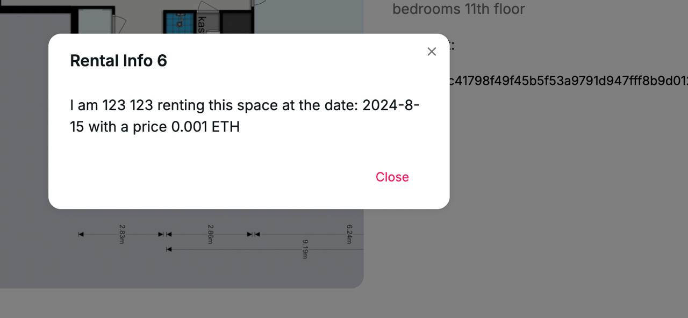

import InTag from '@site/src/components/InText-tag';

# Behind the Curtains

Our NFT Solidity contract might seem similar to other NFTs on the blockchain, <InTag color="#ed8e2f">BUT</InTag> its true value and innovation lie in the scripts that run behind the Solidity minting function.

## Key Components of Our Technology

The following sections provide a straightforward explanation for those without a technical background, making it easy to understand what we do and the value we bring.

### • The Renting Contract
Typically, a rental contract is a lengthy PDF document filled with over 20 fields of sensitive information, such as passport numbers, social security numbers, and more. We will explain how we generate this contract ourselves and securely store it on the blockchain.

### • Solidity Function 
As seen in our code, the `mintNft()` function takes `tokenURI` as a parameter. The `tokenURI` is the metadata of the NFT. This metadata, along with the NFT, will be stored on the blockchain indefinitely, ensuring that the data is preserved as long as it is stored in a blockchain-compatible storage system.

:::note
Example of our NFT: [Sepolia Etherscan Token](https://sepolia.etherscan.io/token/0x783670da7093d19f095ef57904800f447d7266f5)

The NFT we create has immutable metadata! This technology will be further explained later.
:::

### • IPFS 
The storage system we use is called IPFS (InterPlanetary File System). IPFS is a public storage network, meaning anyone can view the data it holds. Additionally, the data stored here is immutable, making it impossible to change or hack, thus securing your rental contract from fraudulent parties. At first glance, you might consider storing your contract here:

```js
{
  "name":"Rental Info 6",
  "image":"ipfs://QmcLEDJtHNw2How2SkmDxWpvKSa5aNDiTkR3PiikCNDaty",
  "item_id":1,
  "contract":"John Doe renting a place at High Street 47 from Jahe Roe for 5000 USD a month with social security number 123456789 and passport number GWR87932 ..."
}
```
However, this is a very insecure way to store sensitive data. Instead, the second though is to use an encoded version of this text, protected by a password required to decode it:
```js
{
  ...
  "contract_id":"55494bf4a71f8aff87476648d48d442d:8763b765dece21059f0ae96061bf7dc9d534478a2631facf2c38ce5dbc42888a1b45a8807c09a011d7854fc7f4033d44f8070b27825767e823a9291bde67ba22a91ceb80b26f5a61d48989f02601e0e5"
}
```
With the password, you can access the text inside. But what if the password is leaked? Your sensitive data will be permanently exposed on the blockchain! :astonished::astonished::astonished: This is why we need one more step.

### • Our Technology Combination
We combine the NFT's capability to store data forever with the security of IPFS and our hashed version of the text.

The final step in storing data on IPFS involves hashing. Hashing is a one-way encryption process, meaning the original content cannot be deciphered from the hash. This is useful because, even though the content cannot be viewed directly, you can hash the object to verify whether the hash matches the one stored on IPFS. This is precisely what we do.

```js
...

export async function decrypt(
  contract: { id: string, data: string, url: string },
  password: string,
) {
  const { contract_id } = await (await fetch(contract.url)).json();

  if (crypto.createHash('sha256').update(contract.data).digest('hex') !== contract_id) {
    throw new Error('Incorrect hash');
  }

  ...
}
```

In simple terms, we store the password-encoded contract on our secure server (which is protected from unauthorized access). When you want to view the NFT's content, you encounter a hash (which cannot be altered within the NFT). When you attempt to decode it, our server generates a hash of the encoded contract and compares it to the hash stored in the NFT. If the hashes match, the data on our server is verified, eliminating the possibility of external or internal attack, and makes so if your password gets leaked your data can be cleared from the blockchain on a request.

:::note 
Example of a URL stored in the same NFT: https://ipfs.io/ipfs/QmeDnQj6z5tZ44QZq6tdN4LkkKZ3rUkkcKHK6grHnNsNCu

```js
{
  "name":"Rental Info 6",
  "image":"ipfs://QmcLEDJtHNw2How2SkmDxWpvKSa5aNDiTkR3PiikCNDaty",
  "item_id":6,
  "contract_id":"594b5e855b95c41798f49f45b5f53a9791d947fff8b9d012071a734f5c468a35"
}
```
:::

Only after all checks are passed do we use the password to decode the contract text. :smile:
The output is the contract text, which appears simple and straightforward from the user’s perspective.
