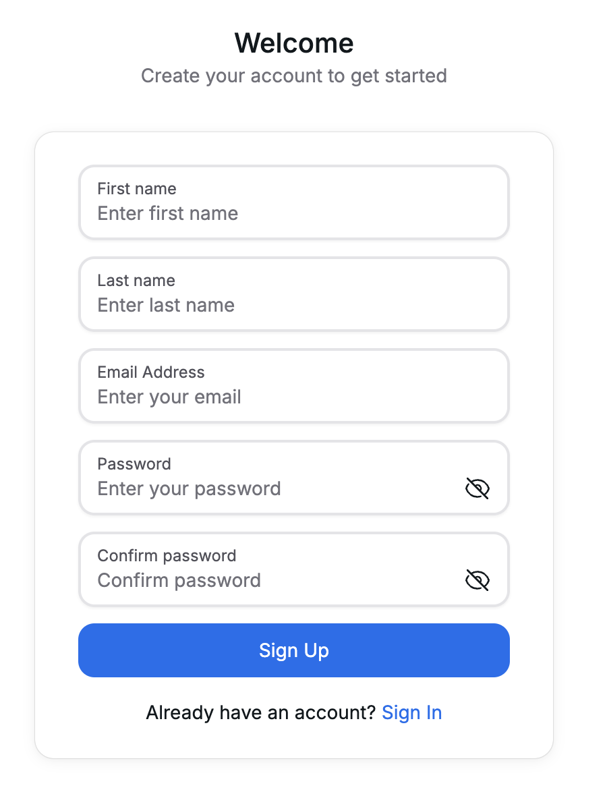
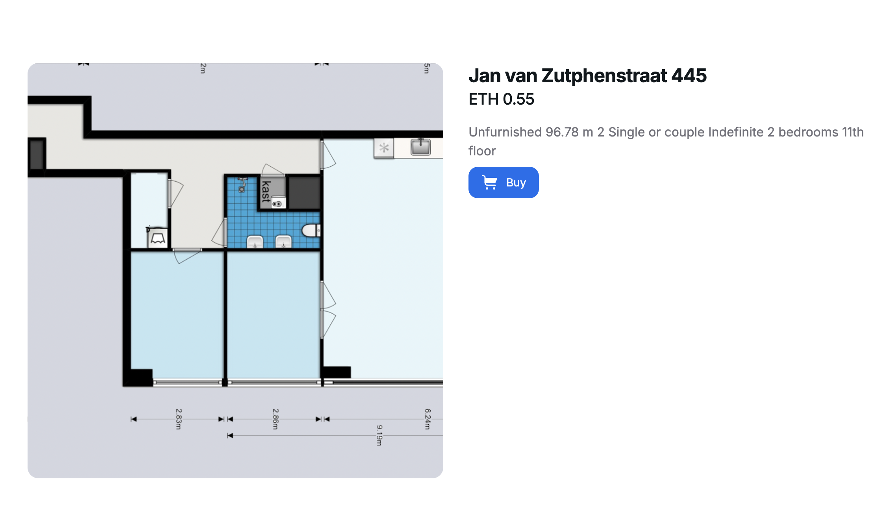
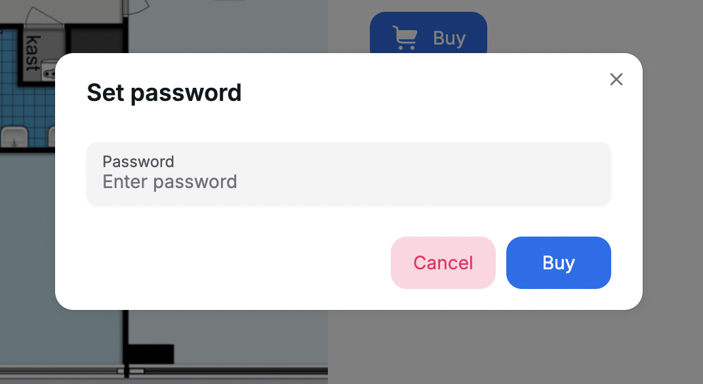
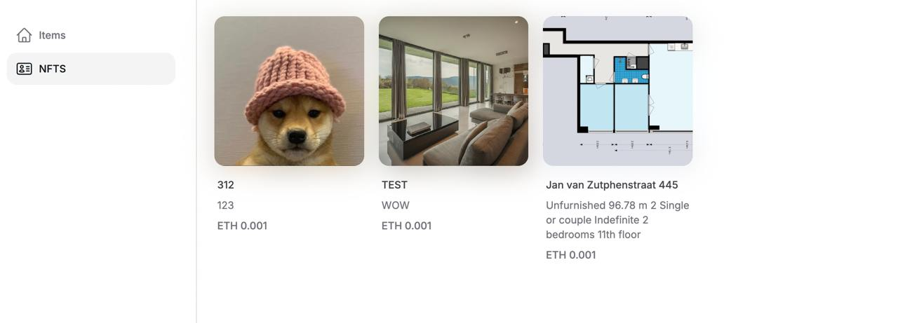
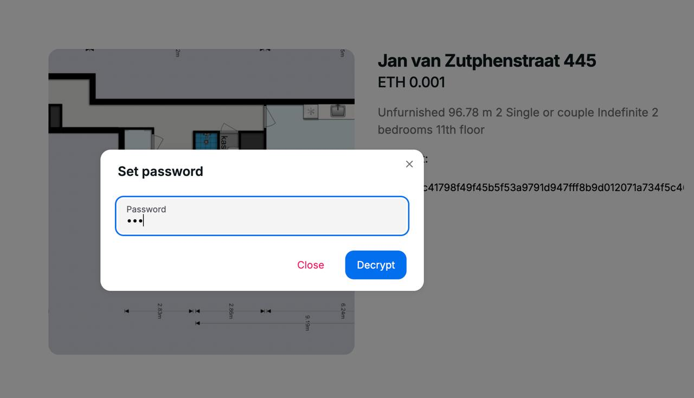

# User perspective

Welcome to the RentDar experience! Here’s how our technology works in practice.

## Step 1: Create an Account

To get started, first, you need to create an account on our platform. This will give you access to all the features and ensure your information is securely stored.

## Step 2: Find Your Desired Apartment

Once your account is set up, it’s time to explore and find the apartment you want to rent. Browse through the available listings and choose the one that best suits your needs.

:::caution

Please take **extra caution** with this step
## Step 3: Set Your Password and Complete the Process

After selecting your apartment, you will need to set a password and finalize the rental process. This password is crucial as it will be required to decode and access your rental contract.

:::

## Step 4: View Your Generated NFT

Once the process is complete, an NFT representing your rented property will be generated. Tap on the NFT to view the details of your contract.

## Step 5: Access Your Contract

Tap on the contract and enter your password to access the details. This ensures that your contract is securely encrypted and accessible only by you.

## Step 6: Review Your Auto-Generated Contract

Finally, you will see the auto-generated rental contract that includes your name, rental date, and price. In future updates, additional information such as your passport number and other necessary details will be included for a more comprehensive record.

Rest assured, all contract parameters are saved on the blockchain in a hashed version. This guarantees that your rental contract cannot be altered and that your sensitive data remains protected by your password.

